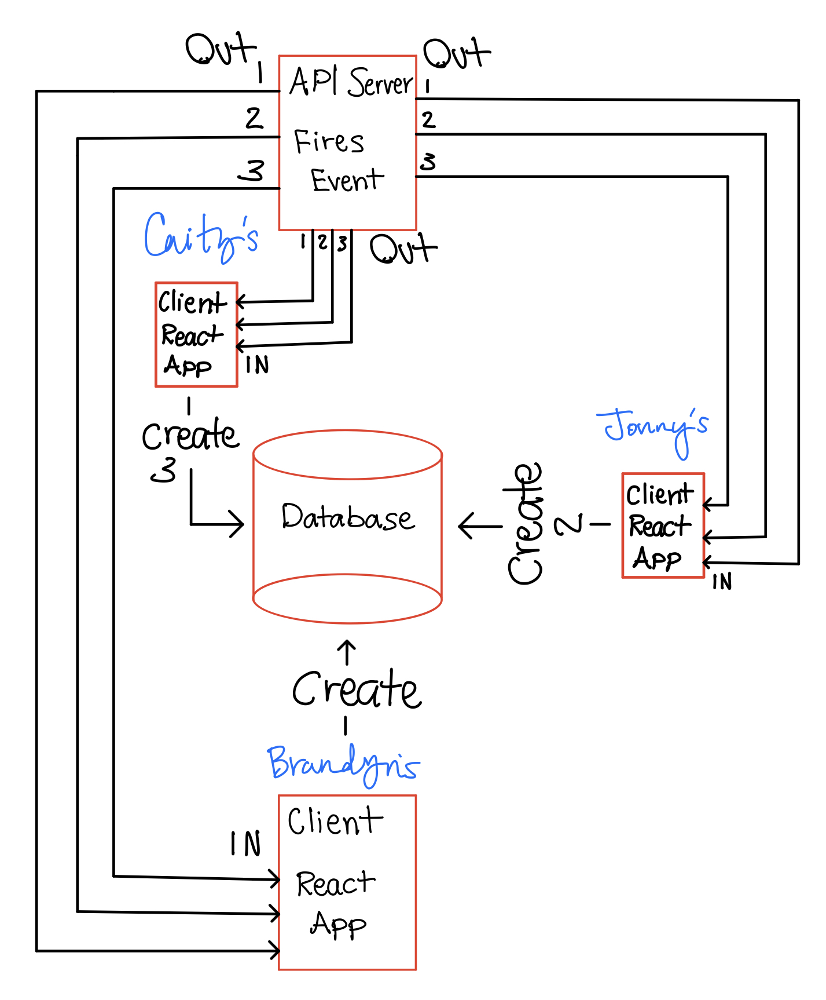

# LAB - 32-todo

## Custom Hooks: Sockets and Fetch

### Author: Brandyn Vay

### Links and Resources

- [submission PR todo](https://github.com/brandyn-vay-401-advanced-javascript/lab-class-32-todo)
- [travis](https://travis-ci.com/brandyn-vay-401-advanced-javascript/lab-class-32-todo)
- [depolyment](https://codesandbox.io/s/lab-class-32-todo-fdpvn)

### Modules

#### `modulename.js`

#### Running the app

- `npm start`

  - Spins up the app on localhost 3000

#### Tests

- How do you run tests?
  - Use npm test in the teerminal to run the tests.

#### UML

